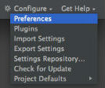
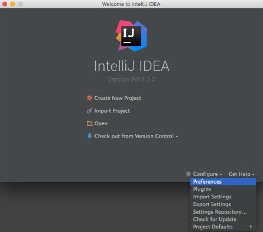
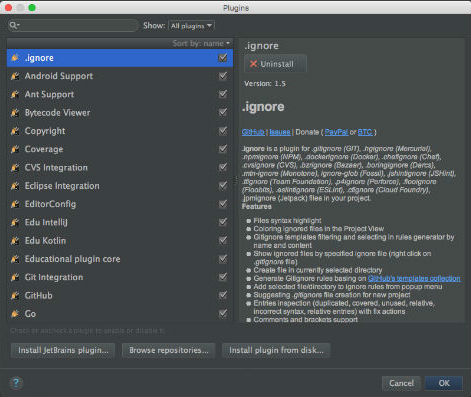
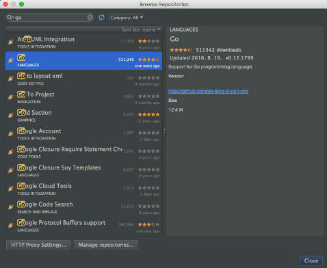
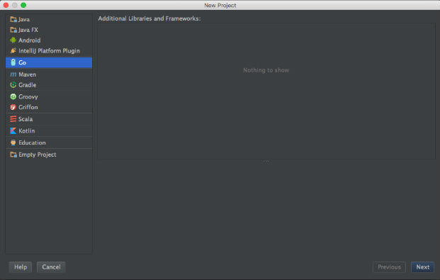
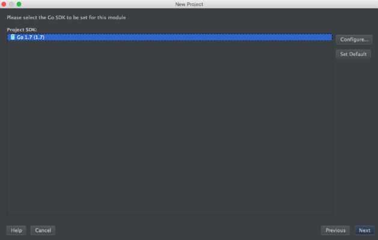
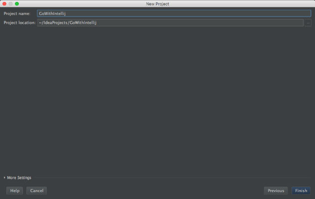
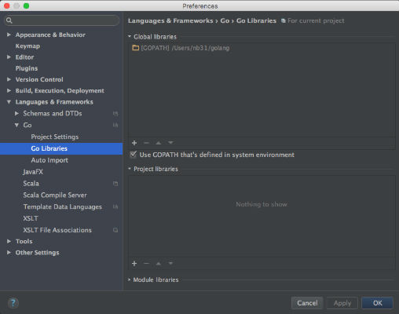
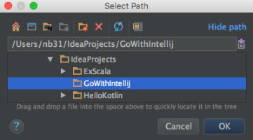
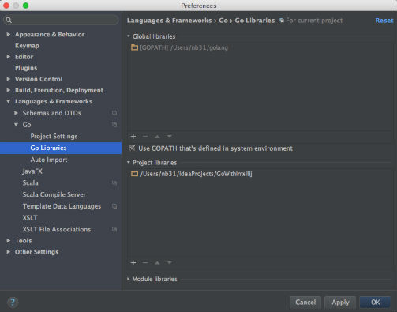

# Intellij 에서 Go 프로젝트 환경 설정 하기






















프로젝트의 구조는 다음과 같다.

```shell
.
├── GoWithIntellij.iml
└── src
    └── MyGo
        ├── main.go
        └── vendor
            └── printer
                └── printer.go
```
